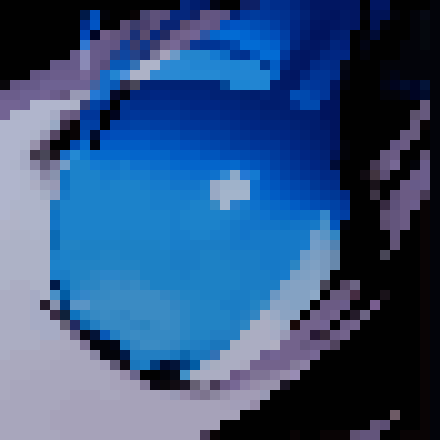

    

<h1 align="center">

<b>CETERAI's VOID</b>

</h1>

<a class="ct_button" href="https://linktr.ee/ceterai">>>> LINKTREE <<<</a>

<a class="ct_button" href="https://www.buymeacoffee.com/ceterai">>>> SUPPORT ME <<<</a>

<a class="ct_button" href="https://discord.gg/gGEwZ5vbgr">>>> DISCORD SERVER <<<</a>

(dev updates, questions, bug reporting, and lots of emojis and stickers! ^^)

<h2 align="center">

<b>NAVIGATION</b>

</h2>

Expand table of contents...

- [Home](/)
  - [My Enternia](/MyEnternia)
    - [Mods](/MyEnternia/Mods)
    - [Wiki](/MyEnternia/Wiki)
  - [Discord Themes](/DiscordThemes)

<h2 align="center">

<b>PROJECTS</b>

</h2>

<ul align="center" style="list-style-type: none; padding: 0; margin: 0;">

<li><a class="ct_button" href="MyEnternia"> My Enternia</a></li>
<li><a class="ct_button" href="DiscordThemes">Discord Themes</a></li>
<li><a class="ct_button" href="https://steamcommunity.com/id/ceterai/myworkshopfiles/?appid=211820">Starbound Mods</a></li>
<li><a class="ct_button" href="Portal2">Portal 2 Maps</a></li>
<li><a class="ct_button" href="CDDZ">Clone Drone Maps & Guides</a></li>
<li><a class="ct_button" href="TimeRifters">Time Rifters Maps</a></li>
<li><a class="ct_button" href="O9000Z">Over 9000 Zombies! Maps</a></li>
<li><a class="ct_button" href="Minecraft">Minecraft Skins & Packs</a></li>
<li><a class="ct_button" href="https://github.com/Ceterai/AltaSS14Sprites">Space Station 14 Sprites</a></li>
<li><a class="ct_button" href="GMod">GMod Collections</a></li>

</ul>

<h2 align="center">

<b>CREDITS</b>

</h2>

<ul align="center" style="list-style-type: none; padding: 0; margin: 0;">

<li><a class="ct_button" href="/art/">Artwork</a></li>

</ul>

