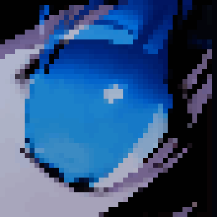

    

<h1 align="center">

<b>CETERAI's LAIR</b>

</h1>

<h4 align="center">

<a href="https://linktr.ee/ceterai">>>> LINKTREE <<<</a>

</h4><h4 align="center">

<a href="https://www.buymeacoffee.com/ceterai">>>> SUPPORT ME <<<</a>

</h4><h4 align="center">

<a href="https://discord.gg/gGEwZ5vbgr">>>> DISCORD SERVER <<<</a>

(dev updates, questions, bug reporting, and lots of emojis and stickers! ^^)

</h4>

<h2 align="center">

<b>PROJECTS</b>

</h2>

<ul align="center" style="list-style-type: none; padding: 0; margin: 0;"><li>

<a href="/DiscordTheme/">Discord Themes</a>

</li></ul>
